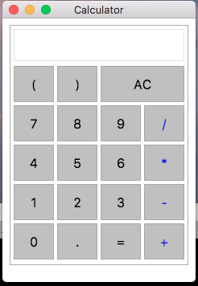

### Simple Desktop Calculator

Screenshot



### To run locally

After clone this repo
```
npm i -g electron-prebuilt
npm i
npm run start
```

### To package an app to distribute

https://github.com/electron-userland/electron-packager/blob/master/docs/api.md

```sh
npm i -g electron-packager
# electron-packager <sourcedir> <appname> --platform=<platform> --arch=<arch> --version=<version>
electron-packager ./calc calcPack --platform=darwin --arch=x64 --version=1.4.12
```
This is for Mac only example